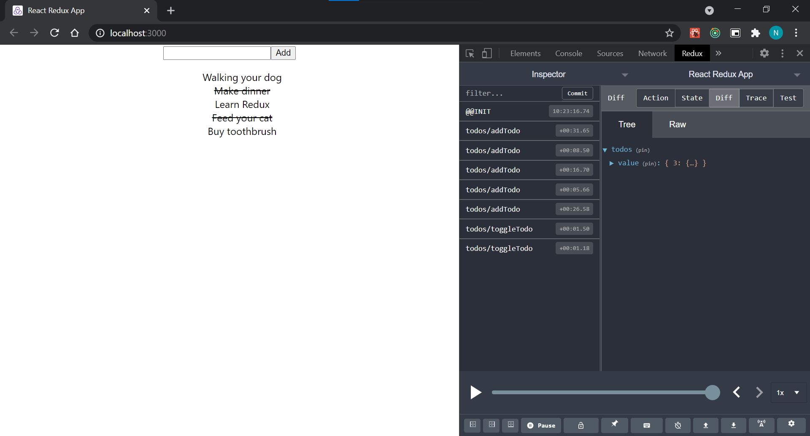

# SIMPLE TO-DO WED APP

Using React, Redux and TypeScript to make an extremely simple To-do Web Application

This project was bootstrapped with [Create React App](https://github.com/facebook/create-react-app), using the [Redux](https://redux.js.org/) and [Redux Toolkit](https://redux-toolkit.js.org/) template.

## How to run this app

```shell
npm install // first time
npm start
```

## How I did it?

1. Use `redux-typescript` template when create a react app

   ```shell
   npx create-react-app simple-todos --template redux-typescript
   ```

2. Delete the the **counter** folder: `./src/features/counter` and anything that related.
3. Create **todos** folder under `./src/features`
4. Create "slice" for **todo**: `todosSlice.ts`

   > [What is slice?](https://redux-toolkit.js.org/tutorials/quick-start)
   >
   > Redux requires that we write all state updates immutably, by making copies of data and updating the copies. However, **Redux Toolkit**'s `createSlice` and `createReducer` APIs use **Immer** inside to allow us to write "mutating" update logic that becomes correct immutable updates.

5. Add newly created `todosReducer` to `store` in `./src/app/store.ts`
   Create ``

   ```typescript
   import { configureStore } from '@reduxjs/toolkit';
   import todosReducer from '../features/todos/todosSlice';

   export const store = configureStore({
     reducer: {
       todos: todosReducer,
     },
   });
   export type RootState = ReturnType<typeof store.getState>;
   ```

6. Create component `AddTodo` and put it in `./src/components` (create new folder **components**)
   **Dispatch** `addTodo` action

7. Create component `TodoList` and put it in `./src/components`

   **Dispatch** `toggleTodo` action

   **useSelector** to get `todos`

   ```typescript
   const todos = useSelector((state: RootState) => state.todos.value);
   ```

8. Complete.

## Demo



## Learn More

You can learn more in the [Create React App documentation](https://facebook.github.io/create-react-app/docs/getting-started).

To learn React, check out the [React documentation](https://reactjs.org/).
